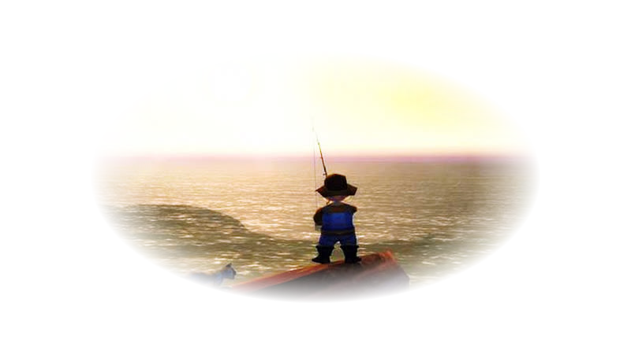

# fishingWoW

  

#### dependencies
> **[numpy](https://pypi.org/project/numpy/)**   
> **[opencv-python](https://pypi.org/project/opencv-python/)**   
> **[mss](https://pypi.org/project/mss/)**   
> **[pynput](https://pypi.org/project/pynput/)**   
> **[imutils](https://pypi.org/project/imutils/)**   
> **[pynput](https://pypi.org/project/pynput/)**   
> **[screeninfo](https://pypi.org/project/screeninfo/)**   

 

